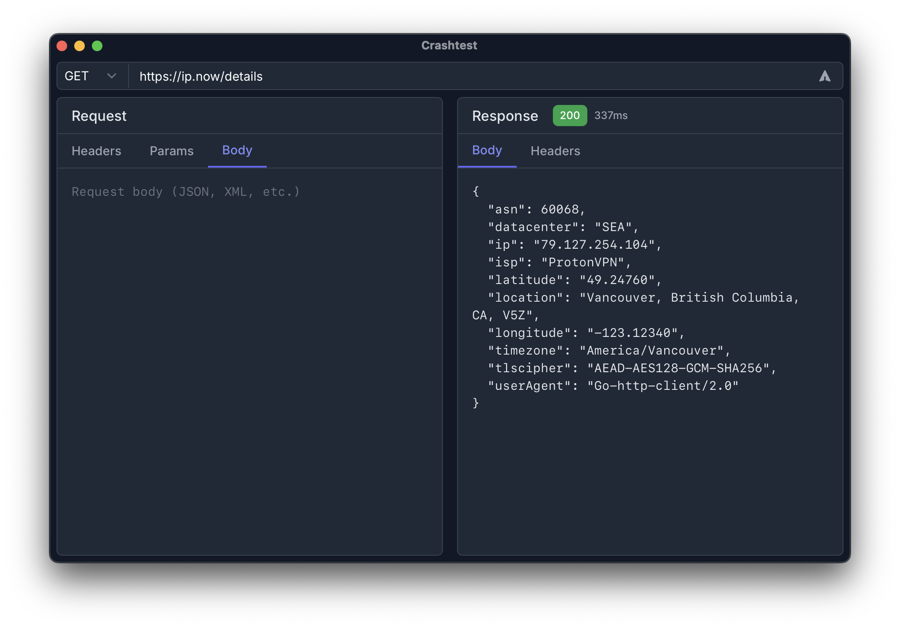

[](https://github.com/gomarcd/crashtest/actions/workflows/release.yml)

# Crashtest

The fast, minimal API tool.

🇨🇦 Made in Canada 🇨🇦



## Features

:white_check_mark: Modern, open source, minimal UI

:white_check_mark: No paywall, no registration

:white_check_mark: Designed with privacy and security in mind

:white_check_mark: Set request parameters and see response headers

:white_check_mark: Cross-platform support: Windows, macOS and Linux

## Technology

Made with love in Golang, with [Wails](https://wails.io).

## Security

:white_check_mark: Runs locally on your machine, the only data ever going out are queries explicitly sent by you - no telemetry, ads or trackers

:white_check_mark: Code signing: macOS binaries are signed with official Apple certificate issued by Developer ID Certification Authority, Windows binaries will be code signed via Azure Trusted Signing pending its identity validation

:white_check_mark: GPG signing: macOS, Windows and Linux binares are always GPG-signed with ed25519 key `A65E9AE2` (Fingerprint: `1353 E058 CB77 A738 F6AE  3362 883E 797A A65E 9AE2`), so you can verify the downloaded files are indeed from me

:white_check_mark: SHA256 checksums accompany downloads for every release so you can verify the integrity of the file - expected checksums are added to [release notes](https://github.com/gomarcd/crashtest/releases/) for convenience

:white_check_mark: All commits/tags pushed into this repository are GPG-signed with key [F7FA7CBDCC32ECA6](https://keys.openpgp.org/search?q=F7FA7CBDCC32ECA6). This key never leaves my local machine, providing high cryptographic assurances any code committed to the repository is my own.

:white_check_mark: **Reproducible builds** with instructions are coming, stay tuned! This will make it easier for anyone who is so inclined to compile the program from source and validate that resulting binaries are bit-for-bit identical to those published in our releases.

### Verify GPG Signature

Make sure you have GPG installed. You can then download our GPG pubkey to verify signatures via one of these methods:

- Here in this repo by clicking `gpg-pubkey.asc` above or click [here](https://github.com/gomarcd/crashtest/blob/main/gpg-pubkey.asc) and then run `gpg --import gpg-pubkey.asc`
- From Ubuntu keyserver with `gpg --keyserver hkps://keyserver.ubuntu.com --recv-keys 1353E058CB77A738F6AE3362883E797AA65E9AE2` or by [clicking here](https://keyserver.ubuntu.com/pks/lookup?search=ci%40crashtest.app&fingerprint=on&op=index)
- From openpgp.org with `gpg --keyserver hkps://keys.openpgp.org --recv-keys 1353E058CB77A738F6AE3362883E797AA65E9AE2` or by [clicking here](https://keys.openpgp.org/search?q=1353E058CB77A738F6AE3362883E797AA65E9AE2)
- Download the release file (e.g., `Crashtest_2025.0.0.1_universal.dmg` or `.exe`) and its corresponding `.sig` file into the same directory.

Once you have downloaded our pubkey and the files you want to verify, run the following command in that directory ensuring filenames match what you actually downloaded:

```
gpg --verify Crashtest_2025.0.0.1_universal.dmg.sig Crashtest_2025.0.0.1_universal.dmg
```

This should output something like this:

```
gpg: Signature made Sun  6 Apr 11:52:54 2025 MDT
gpg:                using EDDSA key 1353E058CB77A738F6AE3362883E797AA65E9AE2
gpg: Good signature from "Crashtest CI <ci@crashtest.app>" 
```

The purpose of this step is to verify with cryptographic assurances that the downloaded file is in fact the intended one.

### Verify SHA256 Checksums

- Download the corresponding `.sha256` file for the Crashtest version you downloaded and follow these steps, being sure to update the commands with the actual filenames you downloaded:

	1. Check if the downloaded file matches the `.sha256` hash:

    ```
    sha256sum -c Crashtest_2025.0.0.1_universal.dmg.sha256` - should output something like `Crashtest_2025.0.0.1_universal.dmg: OK
    ```

    2. Output the downloaded file's SHA256 checksum to verify manually:

    ```
    sha256sum Crashtest_2025.0.0.1_universal.dmg
    ```

    This should output something like:

    ```
    18d6399d63ffec7f7d53ce2b0fbb2b53b686dcd55cdecc4f87bcc98e3be0ba9b  Crashtest_2025.0.0.1_universal.dmg
    ```

    3. Output the checksum from the `.sha256` file:

    ```
    cat Crashtest_2025.0.0.1_universal.dmg.sha256
    ```

    This should match step 2 exactly.

The purpose of this step is to provide cryptographic assurances that the contents of the downloaded file correspond and have not been tampered with.